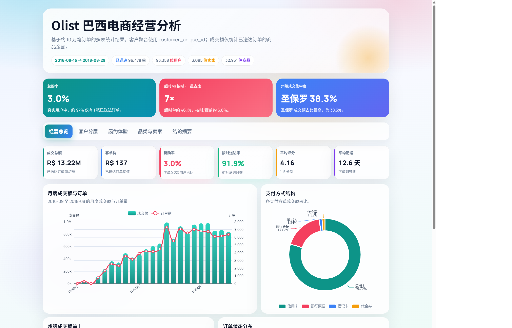
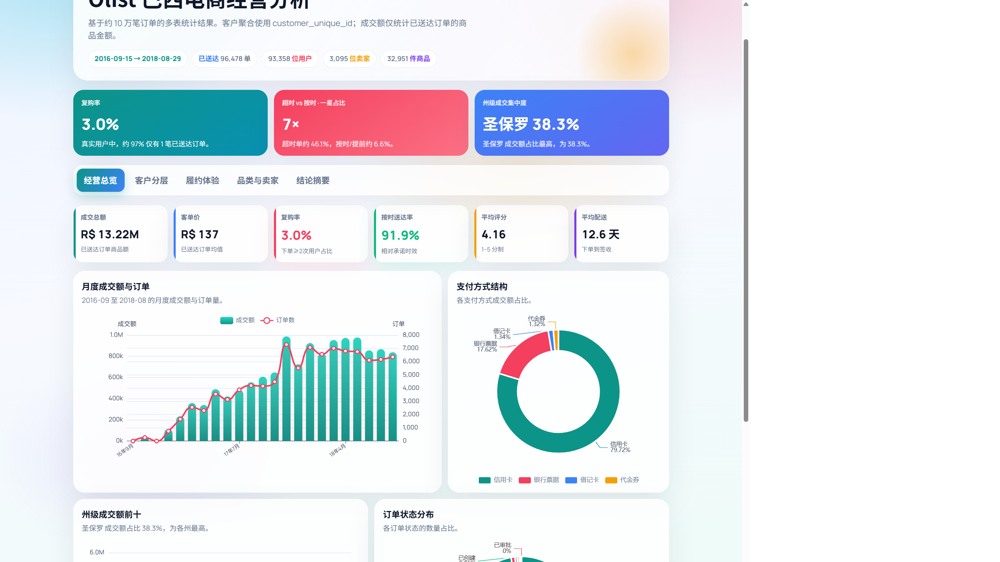
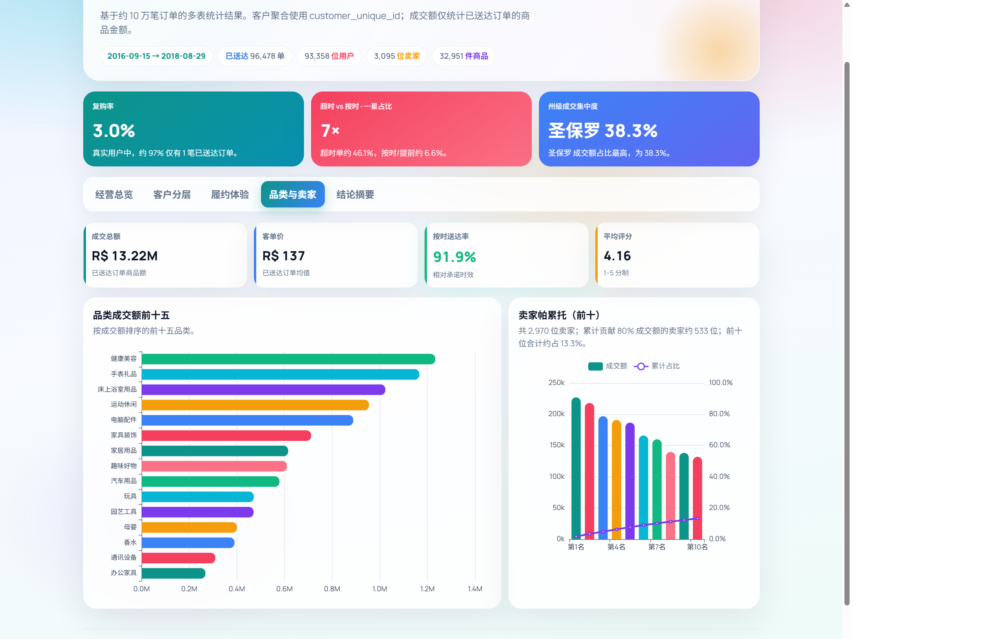
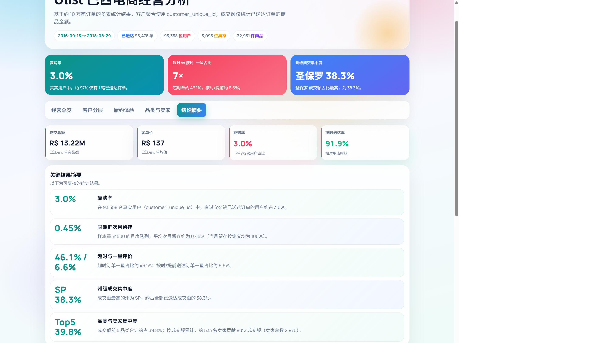

# Olist 巴西电商经营分析

<p align="center">
  
  
  
  
  
  
</p>

基于 [Brazilian E-Commerce Public Dataset by Olist](https://www.kaggle.com/datasets/olistbr/brazilian-ecommerce)（约 10 万订单，2016–2018）的端到端经营分析项目。

完成 **多表清洗关联 → 指标口径设计 → Python / SQL 分析 → React 中文交互看板** 全链路交付。

<p align="center">
  
</p>

<p align="center">
  <a href="#功能亮点">功能亮点</a> ·
  <a href="#关键结果">关键结果</a> ·
  <a href="#看板预览">看板预览</a> ·
  <a href="#技术架构">技术架构</a> ·
  <a href="#快速开始">快速开始</a>
</p>

---

## 目录

| | | |
|---|---|---|
| [项目简介](#项目简介) | [功能亮点](#功能亮点) | [关键结果](#关键结果) |
| [看板预览](#看板预览) | [技术架构](#技术架构) | [数据模型](#数据模型) |
| [项目结构](#项目结构) | [快速开始](#快速开始) | [指标口径](#指标口径) |
| [许可说明](#许可说明) | | |

---

## 项目简介

| 项目 | 说明 |
|------|------|
| **数据来源** | Kaggle · Olist 巴西电商公开数据集 |
| **时间范围** | 2016-09-15 → 2018-08-29 |
| **分析样本** | 已送达 **96,478** 单 · 用户 **93,358** · 卖家 **3,095** · 商品 **32,951** |
| **分析主题** | 经营规模、用户复购与留存、履约与评分、品类 / 卖家集中度 |
| **交付内容** | Python 指标管线 · 主题化 SQL · React + ECharts 中文看板 |
| **仓库** | https://github.com/InfiniteLoopDreamer/olist-ecommerce-analytics |

### 本项目回答的问题

1. 成交额从哪里来？（时间、州、品类、支付）
2. 复购与留存实际如何？（真实用户 ID + 同期群交叉验证）
3. 超时配送与评分是什么关系？
4. 品类与卖家是否过度集中？

---

## 功能亮点

| 模块 | 能力 | 主要图表 |
|------|------|----------|
| **经营总览** | 规模 KPI、月度趋势、支付结构、州级分布、订单状态 | 组合图、环形图、条形图 |
| **客户分层** | 复购、同期群留存、RFM、购买频次、分期与客单价 | 热力图、分层柱图、明细表 |
| **履约体验** | 超时 vs 评分、评分分布、州级超时率与配送天数 | 对比图、柱图、双轴图 |
| **品类与卖家** | 品类 Top15、卖家帕累托（二八） | 横向条形图、帕累托图 |
| **结论摘要** | 关键结果卡片 + 口径说明 | 指标清单 |

<p align="center">
  
</p>

<p align="center">
  
</p>

---

## 关键结果

> 口径：客户聚合使用 `customer_unique_id`；成交额仅统计 `order_status = delivered` 的商品金额（不含运费）。

### 经营规模

| 指标 | 数值 | 说明 |
|------|------|------|
| 成交总额 GMV | **R$ 13.22M** | 已送达订单商品金额合计 |
| 客单价 AOV | **R$ 137** | 成交额 / 已送达订单数 |
| 平均评分 | **4.16** | 1–5 分制 |
| 按时送达率 | **91.9%** | 相对承诺送达时间 |
| 平均配送天数 | **12.6 天** | 下单至签收 |

### 用户与留存

| 指标 | 数值 |
|------|------|
| 复购率 | **3.0%** |
| 同期群平均次月留存 | **0.45%** |
| 仅 1 笔已送达订单的用户占比 | **约 97%** |

### 履约与评分

| 对比项 | 超时配送 | 按时 / 提前 |
|--------|----------|-------------|
| 平均评分 | **2.57** | **4.29** |
| 一星占比 | **46.1%** | **6.6%** |

### 区域与供给

| 指标 | 数值 |
|------|------|
| 圣保罗 SP 成交额占比 | **38.3%** |
| Top 5 品类成交额占比 | **39.8%** |
| 贡献 80% 成交额的卖家数 | **约 533** / 2,970 |

---

## 看板预览

### 1）经营总览

首屏汇总关键发现与经营 KPI，并展示月度成交、支付结构等。

<p align="center">
  
</p>

<p align="center">
  
</p>

| 图表 | 内容 |
|------|------|
| 月度成交额与订单 | 2016-09 至 2018-08 双轴趋势 |
| 支付方式结构 | 信用卡约 79.7%，银行票据约 17.6% |
| 州级成交额前十 | SP 占比最高 |
| 订单状态分布 | 已送达为主 |

### 2）客户分层

同期群留存热力图、RFM 分层、购买频次与分期客单价。

<p align="center">
  
</p>

<p align="center">
  
</p>

| 图表 | 内容 |
|------|------|
| 月度同期群留存 | 仅展示第 1–5 月（不含当月 100%） |
| RFM 客户价值分层 | 近度 / 频次 / 金额分层后的人数与成交额 |
| 购买频次分布 | 绝大多数用户仅 1 单 |
| 分期期数与客单价 | 分期越高，客单价通常越高 |

### 3）履约体验

超时与评分对照、评分分布、主要州超时率。

<p align="center">
  
</p>

<p align="center">
  
</p>

| 图表 | 内容 |
|------|------|
| 超时配送与评分 | 超时组均分 2.57，按时/提前 4.29 |
| 评分分布 | 1–5 星订单量 |
| 州级超时率与配送天数 | 按订单量前十二州 |

### 4）品类与卖家

品类 Top15 与卖家帕累托。

<p align="center">
  
</p>

<p align="center">
  
</p>

| 图表 | 内容 |
|------|------|
| 品类成交额前十五 | 健康美容、手表礼品等居前 |
| 卖家帕累托（前十） | 约 533 卖家贡献 80% 成交；前十约占 13.3% |

### 5）结论摘要

关键结果与数据口径说明，便于复核。

<p align="center">
  
</p>

<p align="center">
  
</p>

---

## 技术架构

<p align="center">
  
</p>

| 层级 | 路径 | 职责 |
|------|------|------|
| **数据层** | `data/raw/` | 原始 CSV（不入库，需自行下载） |
| **计算层** | `scripts/` | 清洗、关联、RFM、同期群、指标导出 |
| **校验层** | `sql/` | 主题 SQL，与 Python 结果交叉核对 |
| **展示层** | `frontend/` | React + TypeScript + ECharts 中文看板 |

### SQL 脚本一览

| 文件 | 内容 |
|------|------|
| `sql/01_repeat.sql` | 复购率 |
| `sql/02_state_gmv.sql` | 州级成交额与集中度 |
| `sql/03_delivery_review.sql` | 超时 vs 评分 |
| `sql/04_rfm.sql` | RFM（窗口函数） |
| `sql/05_cohort.sql` | 月度同期群留存 |
| `sql/06_seller_pareto.sql` | 卖家帕累托 |

---

## 数据模型

### 表关联（ER）

<p align="center">
  
</p>

### 表清单

| 表 | 文件 | 行数 | 用途 |
|----|------|------|------|
| 客户 | `olist_customers_dataset.csv` | 99,441 | 用户与收货州 |
| 订单 | `olist_orders_dataset.csv` | 99,441 | 状态与时间戳 |
| 订单明细 | `olist_order_items_dataset.csv` | 112,650 | 商品金额、卖家 |
| 支付 | `olist_order_payments_dataset.csv` | 103,886 | 支付方式、分期 |
| 评价 | `olist_order_reviews_dataset.csv` | 99,224 | 评分 |
| 商品 | `olist_products_dataset.csv` | 32,951 | 品类与属性 |
| 卖家 | `olist_sellers_dataset.csv` | 3,095 | 卖家与所在州 |
| 品类翻译 | `product_category_name_translation.csv` | — | 葡语 → 英语 |

### 用户标识说明

| 字段 | 数量 | 说明 |
|------|------|------|
| `customer_id` | 99,441 | 随订单生成，一单一值 |
| `customer_unique_id` | 96,096 | 同一自然人；客户级指标使用此字段 |

---

## 项目结构

```text
olist-ecommerce-analytics/
├── data/raw/                      # 原始 CSV（.gitignore）
├── docs/images/                   # README 示意图与看板截图
├── scripts/
│   ├── build_insights.py          # 入口：生成 insights.json
│   └── lib/                       # load / rfm / cohort / insights / paths
├── sql/                           # 01–06 主题 SQL + README
├── frontend/
│   ├── public/data/insights.json  # 预计算指标（可直接跑看板）
│   └── src/                       # React 看板源码
├── requirements.txt
└── README.md
```

---

## 快速开始

### 环境要求

| 工具 | 建议版本 |
|------|----------|
| Python | 3.10+ |
| Node.js | 18+ |

### 启动看板（推荐）

仓库已包含 `frontend/public/data/insights.json`，**无需下载原始 CSV** 即可预览：

```bash
git clone https://github.com/InfiniteLoopDreamer/olist-ecommerce-analytics.git
cd olist-ecommerce-analytics/frontend
npm install
npm run dev
```

浏览器打开终端提示地址（一般为 `http://127.0.0.1:5173/`）。

### 从原始数据重新计算（可选）

1. 从 [Kaggle 数据集页](https://www.kaggle.com/datasets/olistbr/brazilian-ecommerce) 下载并解压 9 个 CSV 到 `data/raw/`
2. 执行：

```bash
pip install -r requirements.txt
python scripts/build_insights.py
cd frontend
npm install
npm run dev
```

---

## 指标口径

| 指标 | 定义 |
|------|------|
| **成交额 GMV** | `delivered` 订单的 `price` 合计（不含运费） |
| **客单价 AOV** | 成交额 / 已送达订单数 |
| **复购率** | `customer_unique_id` 维度，订单数 ≥ 2 的用户占比 |
| **同期群留存** | 按首次下单月分组；period = k 表示首单后第 k 月仍下单 |
| **超时** | 实际签收时间晚于承诺送达时间 |
| **RFM** | R/M 五分位；F 按订单次数分箱（本数据 F 高度集中在 1） |

---

## 许可说明

- **代码**：可用于学习与展示
- **数据**：Olist 原始数据为 [CC BY-NC-SA 4.0](https://creativecommons.org/licenses/by-nc-sa/4.0/)，请保留署名、限非商业用途
- **来源**：[Brazilian E-Commerce Public Dataset by Olist (Kaggle)](https://www.kaggle.com/datasets/olistbr/brazilian-ecommerce)
