# Olist 巴西电商经营分析

基于 [Brazilian E-Commerce Public Dataset by Olist](https://www.kaggle.com/datasets/olistbr/brazilian-ecommerce)（约 10 万订单，2016–2018）的端到端经营分析项目。

完成多表清洗关联、指标口径设计、Python / SQL 分析，以及 React + ECharts 中文交互看板。

<p align="center">
  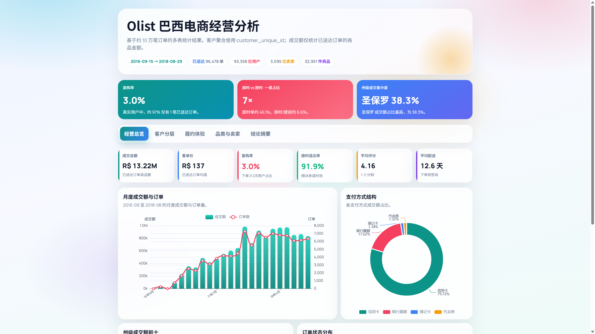
</p>

---

## 目录

1. [项目概览](#1-项目概览)
2. [关键结果](#2-关键结果)
3. [技术架构](#3-技术架构)
4. [数据模型](#4-数据模型)
5. [分析模块](#5-分析模块)
6. [看板与图表](#6-看板与图表)
7. [项目结构](#7-项目结构)
8. [快速开始](#8-快速开始)
9. [指标口径](#9-指标口径)
10. [许可说明](#10-许可说明)

---

## 1. 项目概览

| 项目 | 说明 |
|------|------|
| 数据来源 | Kaggle · Olist 巴西电商公开数据集 |
| 时间范围 | 2016-09-15 → 2018-08-29 |
| 分析样本 | 已送达订单 **96,478** · 用户 **93,358** · 卖家 **3,095** · 商品 **32,951** |
| 交付内容 | Python 指标管线 · 主题化 SQL · 中文交互看板 |
| 技术栈 | Python · pandas · SQL · React · TypeScript · ECharts · Vite |

仓库地址：https://github.com/InfiniteLoopDreamer/olist-ecommerce-analytics

---

## 2. 关键结果

> 统一口径：客户聚合使用 `customer_unique_id`；成交额仅统计 `order_status = delivered` 的商品金额（不含运费）。

### 2.1 经营规模

| 指标 | 数值 |
|------|------|
| 成交总额 GMV | R$ 13.22M |
| 客单价 AOV | R$ 137 |
| 平均评分 | 4.16 |
| 按时送达率 | 91.9% |
| 平均配送天数 | 12.6 天 |

### 2.2 用户与留存

| 指标 | 数值 |
|------|------|
| 复购率 | 3.0% |
| 同期群平均次月留存 | 0.45% |
| 仅 1 笔已送达订单的用户占比 | 约 97% |

### 2.3 履约与评分

| 对比项 | 超时配送 | 按时 / 提前 |
|--------|----------|-------------|
| 平均评分 | 2.57 | 4.29 |
| 一星占比 | 46.1% | 6.6% |

### 2.4 区域与供给

| 指标 | 数值 |
|------|------|
| 圣保罗 SP 成交额占比 | 38.3% |
| Top 5 品类成交额占比 | 39.8% |
| 贡献 80% 成交额的卖家数 | 约 533 / 2,970 |

---

## 3. 技术架构

<p align="center">
  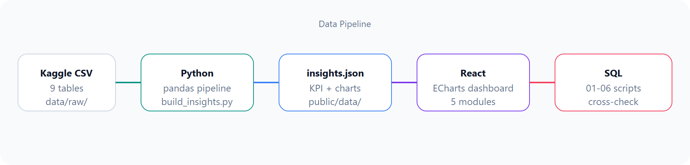
</p>

| 层级 | 路径 | 职责 |
|------|------|------|
| 数据层 | `data/raw/` | 原始 CSV（不入库） |
| 计算层 | `scripts/` | 清洗、关联、RFM、同期群、指标导出 |
| 校验层 | `sql/` | 主题 SQL，与 Python 结果交叉核对 |
| 展示层 | `frontend/` | React + ECharts 中文看板 |

---

## 4. 数据模型

### 4.1 表关联（ER）

<p align="center">
  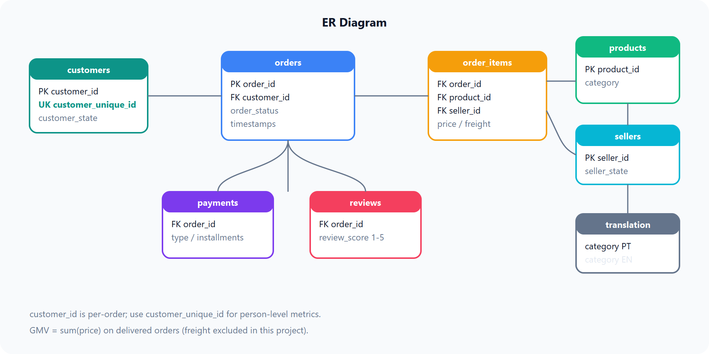
</p>

### 4.2 表清单

| 表 | 文件 | 行数 | 用途 |
|----|------|------|------|
| 客户 | `olist_customers_dataset.csv` | 99,441 | 用户与收货州 |
| 订单 | `olist_orders_dataset.csv` | 99,441 | 状态与时间戳 |
| 订单明细 | `olist_order_items_dataset.csv` | 112,650 | 商品金额、卖家 |
| 支付 | `olist_order_payments_dataset.csv` | 103,886 | 支付方式、分期 |
| 评价 | `olist_order_reviews_dataset.csv` | 99,224 | 评分 |
| 商品 | `olist_products_dataset.csv` | 32,951 | 品类与属性 |
| 卖家 | `olist_sellers_dataset.csv` | 3,095 | 卖家与所在州 |
| 品类翻译 | `product_category_name_translation.csv` | — | 葡语 → 英语 |

### 4.3 用户标识说明

| 字段 | 数量 | 说明 |
|------|------|------|
| `customer_id` | 99,441 | 随订单生成，一单一值 |
| `customer_unique_id` | 96,096 | 同一自然人；客户级指标使用此字段 |

---

## 5. 分析模块

<p align="center">
  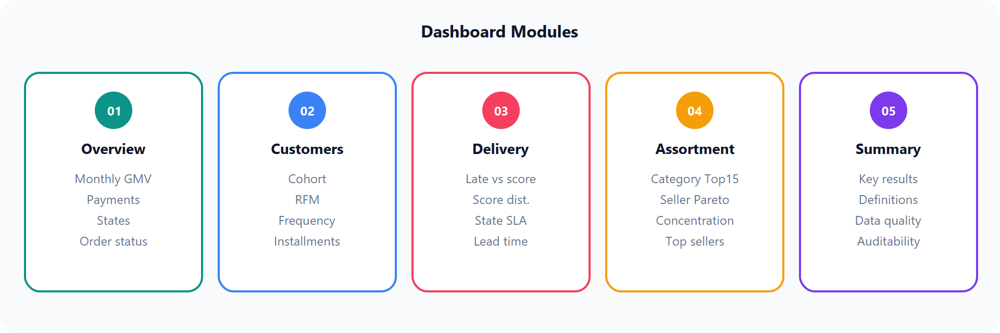
</p>

<p align="center">
  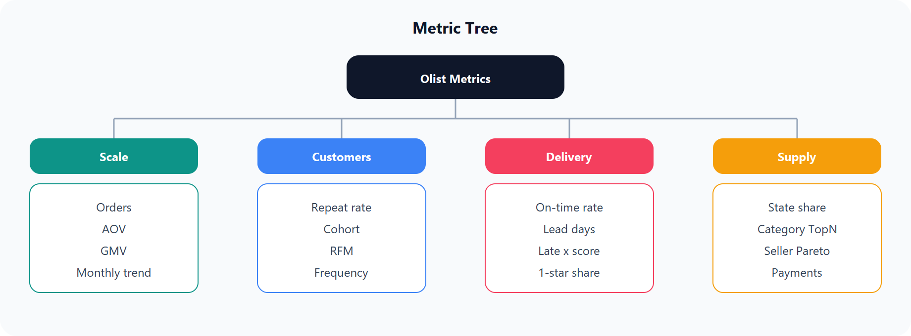
</p>

| 模块 | 内容 | 对应 SQL |
|------|------|----------|
| 经营总览 | 月度趋势、支付、州级、订单状态 | `02_state_gmv.sql` |
| 客户分层 | 同期群、RFM、频次、分期 | `01_repeat.sql` · `04_rfm.sql` · `05_cohort.sql` |
| 履约体验 | 超时与评分、州级配送 | `03_delivery_review.sql` |
| 品类与卖家 | 品类 Top、卖家帕累托 | `06_seller_pareto.sql` |
| 结论摘要 | 关键结果与口径 | — |

---

## 6. 看板与图表

### 6.1 看板页预览

| 经营总览 | 客户分层 |
|:---:|:---:|
|  | 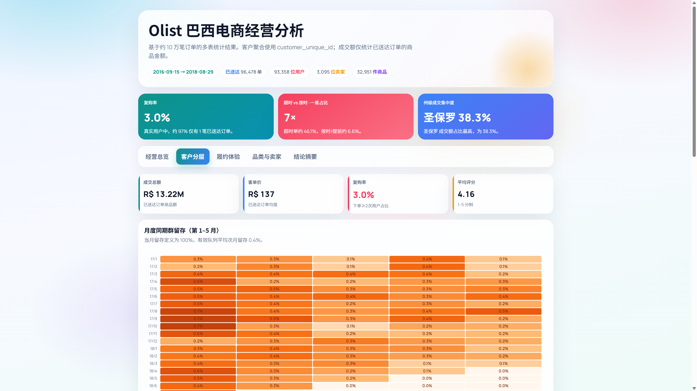 |

| 履约体验 | 品类与卖家 |
|:---:|:---:|
| 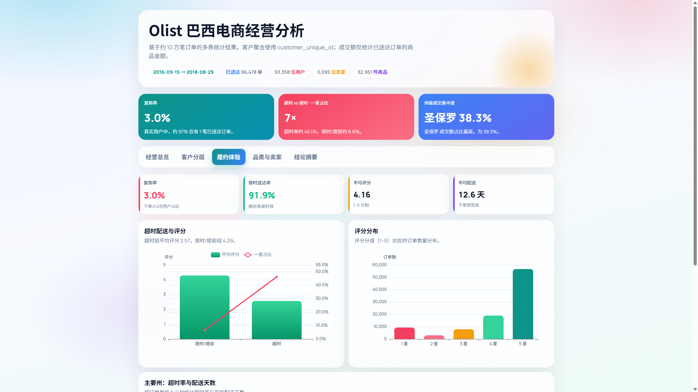 | 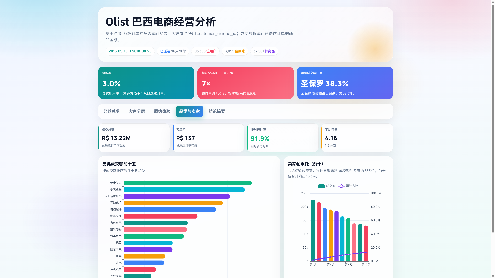 |

<p align="center">
  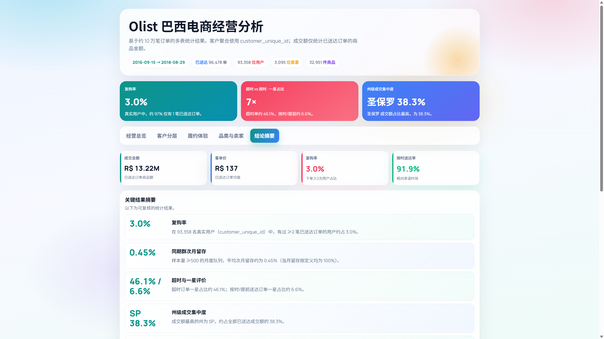
</p>

### 6.2 关键图表细节

| 同期群留存（第 1–5 月） | 超时配送与评分 |
|:---:|:---:|
| 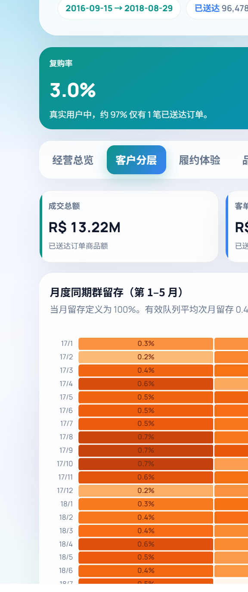 | 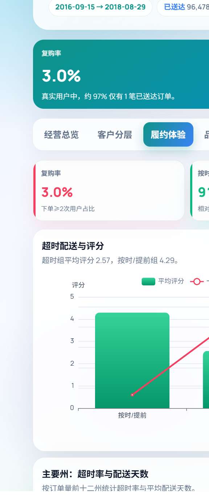 |

---

## 7. 项目结构

```text
├── data/raw/                 # 原始 CSV（.gitignore）
├── docs/images/              # README 示意图与看板截图
├── scripts/
│   ├── build_insights.py     # 生成 insights.json
│   └── lib/                  # load / rfm / cohort / insights
├── sql/                      # 01–06 主题 SQL
├── frontend/                 # React + Vite + ECharts
│   └── public/data/insights.json
├── requirements.txt
└── README.md
```

---

## 8. 快速开始

### 环境

| 工具 | 建议版本 |
|------|----------|
| Python | 3.10+ |
| Node.js | 18+ |

### 启动看板

仓库已包含 `frontend/public/data/insights.json`，可直接启动：

```bash
cd frontend
npm install
npm run dev
```

打开终端提示的本地地址（一般为 `http://127.0.0.1:5173/`）。

### 从原始数据重新计算（可选）

1. 从 [Kaggle](https://www.kaggle.com/datasets/olistbr/brazilian-ecommerce) 下载并解压 9 个 CSV 到 `data/raw/`
2. 执行：

```bash
pip install -r requirements.txt
python scripts/build_insights.py
cd frontend
npm install
npm run dev
```

---

## 9. 指标口径

| 指标 | 定义 |
|------|------|
| 成交额 GMV | `delivered` 订单的 `price` 合计（不含运费） |
| 客单价 AOV | 成交额 / 已送达订单数 |
| 复购率 | `customer_unique_id` 维度，订单数 ≥ 2 的用户占比 |
| 同期群留存 | 按首次下单月分组；period = k 表示首单后第 k 月仍下单 |
| 超时 | 实际签收时间晚于承诺送达时间 |
| RFM | R/M 五分位；F 按订单次数分箱 |

---

## 10. 许可说明

- **代码**：可用于学习与展示
- **数据**：Olist 原始数据为 [CC BY-NC-SA 4.0](https://creativecommons.org/licenses/by-nc-sa/4.0/)，请保留署名、限非商业用途
- **来源**：Brazilian E-Commerce Public Dataset by Olist (Kaggle)
